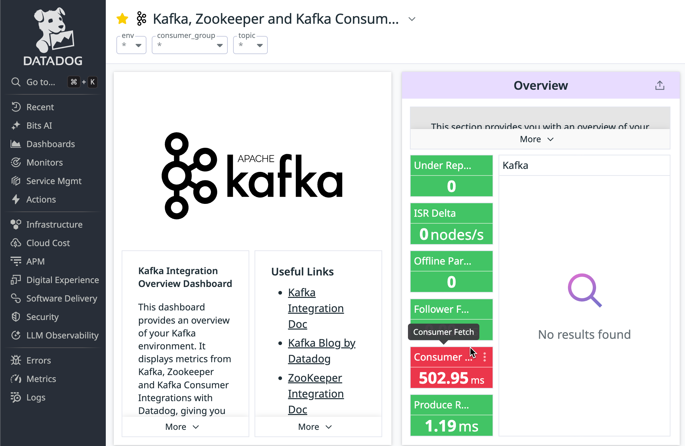

# 🧪 Kafka Microservices Lab (Helm + Datadog)

## 📘 Overview

This lab sets up a Kafka-based microservices application and instruments it with Datadog observability. You'll:

- Install the Datadog Agent using a prebuilt `datadog.yaml`.
- Deploy Kafka and microservices using a Helm chart.
- Monitor Kafka and services using Datadog.

## 🚀 Lab Steps

### 1. ✅ Prerequisites
- A Kubernetes cluster
- `kubectl` configured to point to your cluster
- Helm v3+
- Datadog API key


### 2. 📥 Install the Datadog Agent

```bash
helm repo add datadog https://helm.datadoghq.com
helm install datadog-operator datadog/datadog-operator
kubectl create secret generic datadog-secret --from-literal api-key=XXXXXXXXXXXXXXXXXXXXXXXXXXXXXXXX

kubectl create namespace datadog
kubectl apply -f datadog.yaml -n datadog
```

### 2. 📥 Install Application
```bash
kubectl create namespace kafka
helm install kafka-lab ./kafka-app -n kafka
```
### After installation
```bash
kubectl get pods

kubectl apply -f ./microservices/load-generate/generate.yaml

kubectl port-forward svc/microservice-a -n kafka 8080:80
```

Go to http://localhost:8080/ Use the UI to send normal messages, error messages or generate load (100 messages quickly)

### Within Datadog 

See Pods Running in Kubernetes Explorer: 
https://app.datadoghq.com/orchestration/explorer/pod?query=kube_namespace%3Akafka&explorer-na-groups=false 


See APM traces in Service Catalog
https://app.datadoghq.com/software?env=%2A&fromUser=true&start=1754419847011&end=1754506247011


See Kafka Metrics 
https://app.datadoghq.com/dash/integration/50/kafka-zookeeper-and-kafka-consumer-overview?fromUser=false&refresh_mode=sliding&from_ts=1754505992671&to_ts=1754506292671&live=true



See Data Stream Metrics 
https://app.datadoghq.com/data-streams/map?query=&collapse_pipeline=true&fromUser=false&remove_pipelines=true&start=1754502736349&end=1754506336349&paused=false


See Error Tracking: 
https://app.datadoghq.com/error-tracking?query=&refresh_mode=sliding&source=backend&from_ts=1754422130989&to_ts=1754508530989&live=true


Find where the configuration is within the DD App for:
- Data Streams Monitoring
- Kafka Integration 
- Single Step Instrumentation Instrumentation

